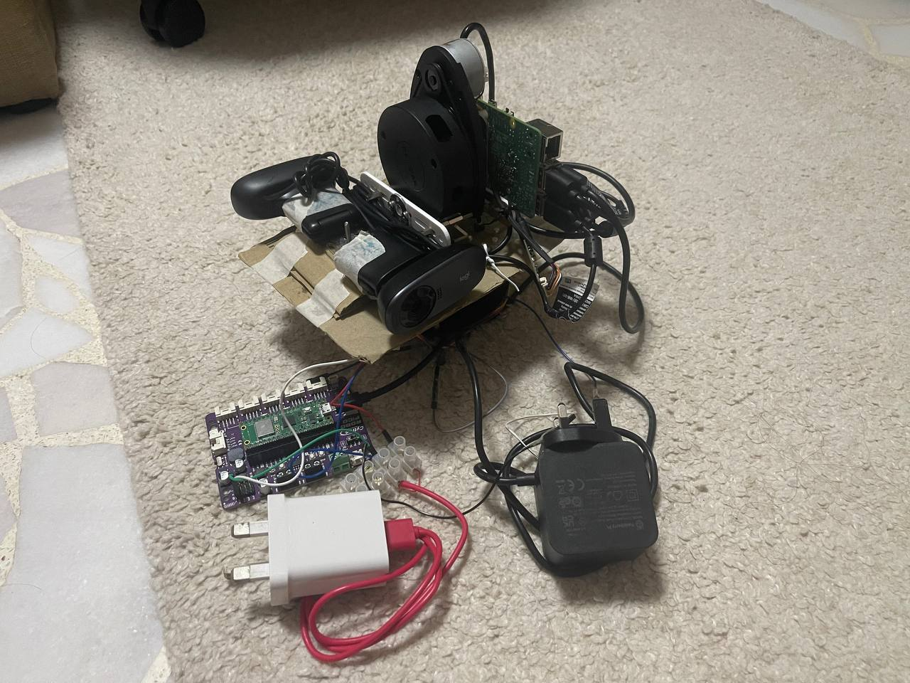

# RPLidar 3D Point Cloud - Distributed Scanning System

**Distributed RPLidar scanning system with Raspberry Pi scanner service and laptop GUI client communicating via MQTT.**

## System Architecture

**Key Features:**
- ✅ **Distributed Architecture**: RPLidar on RPi, visualization on laptop
- ✅ **MQTT Communication**: Reliable QoS 1 message delivery
- ✅ **Network Scanning**: No USB connection to laptop needed
- ✅ **Chunked Transfer**: Large files sent in 256KB chunks
- ✅ **Auto-reassembly**: Files automatically saved to `data/` folder
- ✅ **GUI Integration**: Seamless Open3D visualization

---

## Requirements

### Software
- **Python 3.12** (both laptop and RPi)
- **Mosquitto MQTT Broker** (laptop only)
- **MQTT Explorer** (optional, for debugging)

### Network
- Both devices on same network (WiFi/LAN)
- Laptop must have static IP or known hostname
- Port 1883 (MQTT) open on laptop firewall

### Hardware Wiring (Robust 3D + Panorama)

- **RPLIDAR A1 + CP210x to RP5**:
  - RPLIDAR core TX -> CP210x RX
  - RPLIDAR core RX -> CP210x TX
  - CP210x GND -> RP5 GND
  - CP210x USB -> RP5 USB (serial data path)
- **Servo to Cytron Robo Pico**:
  - Servo Vcc (Red) -> Pico 5V
  - Servo GND (Brown/Black) -> Pico GND
  - Servo PWM (Orange/Yellow) -> Pico GPIO 15
- **Pico to RP5**:
  - Pico Micro-USB -> RP5 USB (serial command path)
- **Webcams to RP5**:
  - Two Logitech C270 webcams connected by USB (update to your specifications)
  - Primary camera path: `/dev/v4l/by-id/usb-046d_081b_DDCCCA90-video-index0`
  - Secondary camera path: `/dev/v4l/by-id/usb-046d_081b_13D1CA90-video-index0`
- **Power**:
  - Use separate stable power for RP5 and servo rail (recommended)



### Robo Pico Firmware Flashing (Required)

Before running robust_3d or panorama scans, flash the servo-controller firmware to the Robo Pico.

1. Connect the Robo Pico to your computer via USB.
2. Open Thonny.
3. In Thonny, set interpreter to MicroPython (Raspberry Pi Pico).
4. Open [FLASH/main.py](FLASH/main.py) from this repository.
5. Save it to the Pico as [main.py](FLASH/main.py) on the device root.
6. Reboot the Pico (or power-cycle USB) and reconnect it to RP5.

Note: If the Pico is not running this firmware, RP5 servo commands (ANGLE/POLICY) will fail.

### 3D Scan Flow (Concise)

1. Laptop publishes `scan_type: "robust_3d"` to `rplidar/commands/scan`.
2. RP5 scanner service runs `robust_3d_scan_module.py`.
3. RP5 drives servo angles via Pico serial (`ANGLE:<deg>`), captures LiDAR slices, and stitches a 3D cloud.
4. RP5 applies voxel downsampling and optional SOR filtering.
5. RP5 publishes `robust_scan_full.ply` and `robust_scan_full.csv` over chunked MQTT.
6. If enabled, RP5 runs RandLA-Net inference and publishes segmentation outputs.

Example robust_3d output (labeled point cloud):


---

## Quick Start

**For complete setup instructions, see [README_SETUP.md](README_SETUP.md)**

### Laptop Setup (5 minutes)
1. Install Mosquitto MQTT broker
2. Configure firewall (port 1883)
3. Install Python dependencies
4. Edit `config_laptop.yaml`

### Raspberry Pi Setup (10 minutes)
1. Clone repository
2. Install Python dependencies (minimal, no GUI)
3. Edit `config_rpi.yaml` with laptop IP
4. Run scanner service

### First Scan Test
```bash
# On RPi terminal:
python rpi_scanner_service.py

# On laptop:
python viewer/app.py
# Click "Start Scan" button in GUI
```

---

## Project Structure
```
RPLidar-3D-PointCloud/
├── rpi_scanner_service.py      # RP5 entrypoint: dispatches robust_3d/panorama scans
├── robust_3d_scan_module.py    # Robust 3D slice capture, stitching, filtering, file export
├── panorama_scan_module.py     # Servo-stepped dual-camera panorama capture with recovery
├── config_rpi.yaml             # RP5 scan params (scan3d + panorama + segmentation)
├── laptop_viewer_client.py     # Laptop MQTT client: command + file reassembly
├── viewer/
│   ├── app.py                  # GUI
│   ├── scan_controller.py      # Start/stop/step controls for robust_3d and panorama
│   └── panorama_stitcher.py    # Laptop-side panorama stitching utilities
├── mqtt_protocol/              # Topics and message schemas
├── requirements_rpi.txt        # RP5 runtime dependencies
├── requirements_laptop.txt     # Laptop runtime dependencies
└── data/
  ├── robust_scan_full.ply    # Stitched robust_3d cloud
  ├── robust_scan_full.csv    # Stitched robust_3d points
  └── images/panorama_*.jpg   # Panorama capture frames
```

---

## MQTT Communication Protocol

### Topics

| Topic | Publisher | Subscriber | Purpose |
|-------|-----------|------------|---------|
| `rplidar/commands/scan` | Laptop | RPi | Scan command requests |
| `rplidar/status/<scan_id>` | RPi | Laptop | Scan status updates |
| `rplidar/data/<scan_id>` | RPi | Laptop | Chunked file transfer |

### Message Flow

**1. Scan Request (Laptop -> RP5)**
```json
{
  "scan_id": "scan_20260224_143022",
  "scan_type": "robust_3d",
  "port": "/dev/ttyUSB0",
  "timestamp": 1708783822.5
}
```

**2. Status Updates (RP5 -> Laptop)**

During robust_3d and panorama runs, RP5 publishes `started` progress messages and then a final `completed/error/stopped` status.

```json
{
  "scan_id": "scan_20260224_143022",
  "status": "completed",
  "message": "Scan completed successfully",
  "timestamp": 1708783835.2,
  "point_count": 8421,
  "files": ["robust_scan_full.ply", "robust_scan_full.csv"]
}
```

**3. Data Transfer (RP5 -> Laptop)**
```json
{
  "scan_id": "scan_20260224_143022",
  "filename": "robust_scan_full.ply",
  "chunk_index": 0,
  "total_chunks": 3,
  "data": "<base64_encoded_chunk>",
  "timestamp": 1708783835.5
}
```

**4. Panorama Request (Laptop -> RP5)**

Set `scan_type` to `panorama`; RP5 captures dual-camera images while stepping servo angles.

```json
{
  "scan_id": "scan_20260224_144501",
  "scan_type": "panorama",
  "port": "auto",
  "timestamp": 1708784101.2
}
```

Panorama files are sent as `panorama_XX.jpg` in chunked data messages.

### QoS & Reliability
- **QoS 1** (At least once delivery) for all messages
- **Chunked transfer**: 256KB chunks with base64 encoding
- **Auto-reassembly**: Files reconstructed on laptop
- **Error handling**: Status messages report failures

---

## Configuration Files

### `config_rpi.yaml` (Raspberry Pi)

User-configured fields in this file:
- `mqtt.broker_host`
- `panorama.camera_index`
- `panorama.camera_secondary_index`
- `segmentation.enabled` and segmentation paths (if used)

```yaml
mqtt:
  broker_host: "<set_to_laptop_broker_host>"  # user configured
  broker_port: 1883
  qos: 1

device:
  role: "scanner"
  client_id: "rplidar_scanner_rpi"
  default_port: "/dev/ttyUSB0"

data:
  output_dir: "./data"
  formats: ["csv", "ply"]

servo:
  serial_port: "auto"
  baudrate: 115200
  timeout: 8.0
  settle_time: 0.5

scan3d:
  sweep_start: 0
  sweep_end: 180
  num_steps: 91
  voxel_size_m: 0.01
  sor_neighbors: 12
  sor_std_ratio: 1.0
  sor_radius_m: 0.08

panorama:
  inherit_scan3d_sweep: true
  start_deg: 0
  end_deg: 160
  step_deg: 20
  camera_index: "<set_primary_camera_source>"      # user configured
  camera_secondary_index: "<set_secondary_camera_source>"  # user configured
  image_format: jpg
  image_width: 1280
  image_height: 720

segmentation:
  enabled: true
  checkpoint: "<set_if_custom_checkpoint_path>"  # user configured when customized
  output_dir: "<set_if_custom_output_dir>"       # user configured when customized

logging:
  level: "INFO"
```

### `config_laptop.yaml` (Laptop)

User-configured fields in this file:
- `mqtt.broker_host` (if broker is not local)
- `data.receive_dir` (optional)

```yaml
mqtt:
  broker_host: "<set_to_broker_host>"  # user configured
  broker_port: 1883
  qos: 1

device:
  role: "client"
  client_id: "rplidar_viewer_laptop"

data:
  receive_dir: "./data"
  auto_load: true

logging:
  level: "INFO"

viewer:
  window_width: 1280
  window_height: 720
  point_size: 2.0
```

---

## Usage

### Start Scanner Service (Raspberry Pi)
```bash
cd ~/rplidar-scanner
source venv/bin/activate
python rpi_scanner_service.py
```

**Expected Output:**
```
======================================================================
RPLidar Scanner Service (Raspberry Pi)
======================================================================

INFO - RPi Scanner Service initialized
INFO - Connecting to MQTT broker at `your laptop ip`:1883
INFO - Connected to MQTT broker successfully
INFO - Ready to receive scan commands
Scanner service running - press Ctrl+C to exit
```

### Launch GUI Viewer (Laptop)
```powershell
python viewer/app.py
```

### Run 3D Scan (with RandLA-Net Inference)

1. Go to **"Scan Control"** tab.
2. Select **"robust_3d"** scan type.
3. Confirm LiDAR port (`auto` recommended).
4. Click **"Start Scan"**.
5. Wait for completion and file transfer (`robust_scan_full.ply`, `robust_scan_full.csv`).
6. Go to **"Visualization"** and open the transferred `.ply` file.

### Run Panorama Scan

1. In `config_rpi.yaml`, set both `panorama.camera_index` and `panorama.camera_secondary_index` to explicit sources.
2. In GUI **"Scan Control"**, select **"panorama"**.
3. Click **"Start Scan"**.
4. Wait for transfer of `data/images/panorama_*.jpg` files.
5. Optionally stitch images on laptop using `viewer/panorama_stitcher.py`.

Example stitched panorama output:

.jpg)

---

## Troubleshooting

### Issue: "MQTT client not initialized"
**Cause**: Mosquitto broker not running on laptop  
**Fix**:
```powershell
net start mosquitto
# or
sc query mosquitto  # Check status
```

### Issue: RPi can't connect to broker
**Cause**: Firewall blocking port 1883 or wrong IP in `config_rpi.yaml`  
**Fix**:
```powershell
# On laptop, check firewall
Get-NetFirewallRule -DisplayName "Mosquitto MQTT"

# Add rule if missing
New-NetFirewallRule -DisplayName "Mosquitto MQTT" `
    -Direction Inbound -Protocol TCP -LocalPort 1883 -Action Allow
```

**Test connectivity from RPi**:
```bash
ping "your laptop ip"
telnet "your laptop ip" 1883
```

### Issue: No data received after scan
**Check MQTT messages**: Use MQTT Explorer (GUI) or mosquitto_sub (CLI):
```powershell
# Option 1: MQTT Explorer (GUI)
# Launch from Start Menu, connect to localhost:1883
# Subscribe to: rplidar/#

# Option 2: CLI
cd "C:\Program Files\mosquitto"
.\mosquitto_sub.exe -h localhost -t "rplidar/#" -v
```

**Check RPi logs**:
```bash
tail -f ~/rplidar-scanner/rpi_scanner.log
```

### Issue: RPLidar not detected on RPi
```bash
# Check if device is connected
lsusb | grep CP210

# Check serial ports
ls -l /dev/ttyUSB*

# Add user to dialout group (if permission denied)
sudo usermod -a -G dialout raspberrypi
# Log out and log back in
```

---

## Documentation

- **[README_SETUP.md](README_SETUP.md)** - Complete setup guide for laptop and Raspberry Pi
- **[DRIVER_INSTALL.md](DRIVER_INSTALL.md)** - CP210x USB driver installation (Windows)

---

## Dependencies

### Laptop (Full)
```
paho-mqtt                 # MQTT communication
open3d==0.19.0            # 3D visualization and processing
numpy
opencv-python
pyyaml                    # Configuration parsing
```

### Raspberry Pi (Minimal)
```
rplidar-roboticia         # LiDAR communication
pyserial                  # Serial port detection
paho-mqtt                 # MQTT communication
pyyaml                    # Configuration parsing
numpy<2
scipy
opencv-python-headless    # Panorama capture runtime
gpiozero
lgpio
--extra-index-url https://download.pytorch.org/whl/cpu/
torch>=2.2,<2.3           # Optional RandLA-Net inference runtime
```

---

## Design Decisions

### Why MQTT?
- **Decoupling**: Scanner and viewer run independently
- **Reliability**: QoS 1 ensures message delivery
- **Scalability**: Easy to add multiple clients/scanners
- **Debugging**: MQTT Explorer provides visual monitoring

### Why Chunked Transfer?
- MQTT has message size limits (~256MB depending on broker)
- 256KB chunks ensure reliable delivery over WiFi
- Base64 encoding for binary-safe transmission
- Progressive reassembly reduces memory usage


---

## References

1. Hu, Q., Yang, B., Xie, L., Rosa, S., Guo, Y., Wang, Z., Trigoni, N., and Markham, A. (2020). RandLA-Net: Efficient semantic segmentation of large-scale point clouds. In Proceedings of the IEEE/CVF Conference on Computer Vision and Pattern Recognition (CVPR), 11105-11114. https://doi.org/10.1109/CVPR42600.2020.01112
2. Lyu, W., Ke, W., Sheng, H., Ma, X., and Zhang, H. (2024). Dynamic downsampling algorithm for 3D point cloud map based on voxel filtering. Applied Sciences, 14(8), 3160. https://doi.org/10.3390/app14083160

---

## License

MIT License
